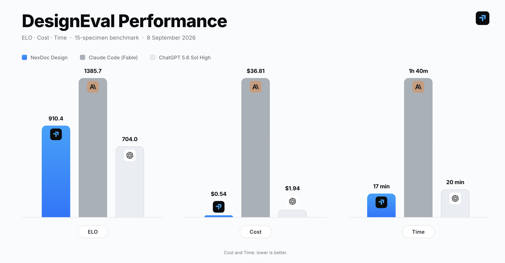

# NexDoc DesignEval: Presentation & Document Design Benchmark for AI

**DesignEval** measures visual design, spatial layout, brand-system compliance, and typography craft across AI agents and frontier LLMs.

This repository includes the 15-specimen anthology brief, rendered slide images, an OpenRouter pairwise judge runner, and a sequential Elo calculator.

---

## Benchmark Overview

Current AI benchmarks (MMLU, SWE-bench, HumanEval) evaluate coding logic and reasoning, but ignore **visual craft, spatial layout, brand compliance, and document aesthetics**.

DesignEval tests generators against **15 standardized production-grade design briefs** (pitch decks, sales presentations, QBRs, keynotes, and more). Each generator produces the same 15 widescreen 16:9 slides. Blind multimodal judges then compare full decks in one request.

```
┌─────────────────────────┐      ┌─────────────────────────┐      ┌─────────────────────────┐
│ 15 Standardized Briefs  │ ───► │ Generation              │ ───► │ Rendered slides (PNG)   │
│ slide-decks-prompt.md   │      │ NexDoc / Claude / GPT   │      │ claude / GPT / nexdoc-  │
└─────────────────────────┘      └─────────────────────────┘      │ design/proof-01..15.png │
                                                                               │
┌─────────────────────────┐      ┌─────────────────────────┐                   ▼
│ Sequential Elo          │ ◄─── │ data/battles.csv        │ ◄──── Blind pairwise judging
│ compute_elo.py          │      │ results/eval_results.json│      run_evals.py (OpenRouter)
└─────────────────────────┘      └─────────────────────────┘
```

---

## Current Leaderboard (15-Specimen Benchmark)

Judged 8 September 2026. Three generators, four OpenRouter judges, position-swapped rematches. **360** slide-level judgments from **24** deck-vs-deck battles.



| Rank | Generator | Elo | Win Rate | Slide Battles | Generation Time | Generation Cost |
| :---: | --- | ---: | ---: | ---: | ---: | ---: |
| 1 | **Claude Code (Fable)** | **1385.7** | **96.7%** | 240 | 1 h 40 min | ~$36.81 |
| 2 | **NexDoc Design** | **910.4** | **42.7%** | 240 | 17 min | ~$0.54 |
| 3 | **ChatGPT 5.6 Sol High (Codex)** | **704.0** | **10.6%** | 240 | 20 min | ~$1.94 |

Head-to-head (ties count as 0.5):

| Matchup | Result |
| --- | --- |
| Claude vs NexDoc | Claude **95.4%** (114.5 / 120) |
| Claude vs GPT | Claude **97.9%** (117.5 / 120) |
| NexDoc vs GPT | NexDoc **80.8%** (97.0 / 120) |

Judges (each saw every pair twice, A/B swapped): Muse Spark 1.3 max, Grok 4.6 high, Gemini 3.8 Flash (high), Claude Opus 5 max. OpenRouter judging cost for this run: **$6.18**. Generation and judging cost detail: [run-costs.md](./run-costs.md).

---

## The 15 Standardized Design Briefs

Every generator received the same anthology brief in `slide-decks-prompt.md` / `eval-prompt.md`: exactly 15 standalone 16:9 slides, each from a different fictional deck, with a forced palette.

| # | Deck Type | Fictional Brand | Representative Slide | Required Palette Hexes |
| --- | --- | --- | --- | --- |
| 1 | Startup Pitch Deck | **Asterloop** | Traction / ARR momentum | Near-black `#080A09`, electric lime `#B7FF3C`, cool white `#F4F7F5`, steel `#7C8A84` |
| 2 | Employee Onboarding | **Fieldnote Studio** | First 30-day journey | Clay `#B4533C`, blush `#FCE9DF`, aubergine `#3B1839`, marigold `#F2B544` |
| 3 | Enterprise Sales Deck | **SignalPath** | Before/after value transformation | White `#FFFFFF`, azure `#1463FF`, vermilion `#FF4B3E`, ink `#101828`, pale blue `#E8F0FF` |
| 4 | Climate Investment Deck | **Meridian Climate Fund II** | Thesis and target portfolio | Evergreen `#062E26`, mineral `#E9F0E8`, antique gold `#C9A44C`, coral `#E8785E` |
| 5 | Product Keynote | **Arc One** | Premium hardware reveal | Brushed silver `#D8DADD`, graphite `#161719`, signal red `#E21D2D`, white `#FFFFFF` |
| 6 | Quarterly Business Review | **Pylon Commerce** | Q3 scorecard and activation gap | Midnight navy `#071A2B`, turquoise `#20D3C2`, tangerine `#FF8A34`, mist `#DDEBF0` |
| 7 | Corporate Strategy | **Northbank Transit** | 2027 strategic pillars | Civic cream `#F3E9D2`, brick `#9D3D2E`, sky `#5AA9D6`, charcoal `#282624` |
| 8 | Project Kickoff | **Horizon Bank** | 20-week roadmap and decision gates | Lavender `#EEE8FF`, deep violet `#4C1D95`, citron `#D8F24A`, black `#17131E` |
| 9 | Leadership Framework | **Grounded Leaders** | 4C conversation loop | Butter yellow `#F6E7A1`, bottle green `#174A3A`, berry `#A12B5D`, warm black `#20201D` |
| 10 | Consumer Research | **Pattern Lab** | Gen Z urban mobility findings | Blush `#FFE8EF`, cobalt `#2447E5`, hot pink `#F02D7D`, oxblood `#4A102A` |
| 11 | Keynote Talk | **Assembly 2026 / Dr. Chen** | Hidden physical interfaces | Saturated cobalt `#0528D6`, white `#FFFFFF`, optical cyan `#52F7FF`, black `#050505` |
| 12 | Company All-Hands | **Harbor** | Company health and 90-day focus | Safety orange `#FF6A21`, ink `#17212B`, powder blue `#B9DDF5`, white `#FFFFFF` |
| 13 | Nonprofit Campaign | **WildCorridor** | Reconnect 100 land ask | Sage `#B9C9A3`, moss `#263D2C`, ochre `#D9912B`, river `#397C8A`, paper `#F4F0E6` |
| 14 | Design Education | **Meridian School of Design** | Annotated typographic anatomy | White `#FFFFFF`, black `#000000`, red `#E3262E`, blue `#165DFF`, yellow `#FFD400` |
| 15 | Sponsorship Deck | **Future Food Forum** | Partner reach and packages | Deep plum `#2B123C`, neon peach `#FF9C7A`, aqua `#63E6D6`, lilac `#C9B6FF` |

---

## How to Reproduce

### 1. Generate the slides

Use `slide-decks-prompt.md` as the generation brief.

1. **NexDoc Design** — run via the NexDoc MCP / `https://nexdoc.design/skills.md`.
2. **Claude** — run the same brief in Claude Code (this run used Fable as the main agent, with Opus and Sonnet as assistants).
3. **ChatGPT** — run the same brief in Codex / GPT-5.6 Sol High.

Save one PNG per slide as `proof-01.png` … `proof-15.png` in:

- `nexdoc-design/`
- `claude/`
- `GPT/`

Source PDFs from this run: `slide-deck-nexdoc-design.pdf`, `slide-deck-claude-fable.pdf`, `slide-deck-chat-gpt-5.6-high-codex.pdf`.

### 2. Blind pairwise judging (`run_evals.py`)

Judging is automated through OpenRouter. Set `OPENROUTER_API_KEY` in `.env`.

```bash
pip install -r requirements.txt
python3 run_evals.py --all --concurrency 3
```

Useful flags:

```bash
python3 run_evals.py --smoke          # two battles, to verify the pipeline
python3 run_evals.py --all --force    # re-run even if result JSON already exists
python3 run_evals.py --judges gemini,opus --designers nexdoc-design,claude
python3 run_evals.py --all --dry-run  # print the battle matrix only
```

What the runner does:

- Builds every unordered pair of designers (`nexdoc-design`, `claude`, `GPT`).
- For each pair and each judge, sends **all 15 matching slides in one request** (Design A slide 1, Design B slide 1, … slide 15).
- Repeats the matchup with **A/B swapped** to reduce position bias.
- Keeps generator names out of the judge prompt. Mapping lives only in result metadata (`design_a`, `design_b`, labels).
- Uses the rubric in `eval-prompt.md` (brand compliance, hierarchy/spacing, structural integrity). The model returns JSON with one winner per slide: `Design A` | `Design B` | `Tie`.
- Writes one JSON file per battle under `results/`, an aggregate `results/eval_results.json`, and `data/battles.csv`.

Judges and reasoning effort:

| Key | Model | OpenRouter slug | Effort |
| --- | --- | --- | --- |
| `muse` | Muse Spark 1.3 max | `meta/muse-spark-1.3` | `max` |
| `grok` | Grok 4.6 high | `x-ai/grok-4.6` | `high` |
| `gemini` | Gemini 3.8 Flash | `google/gemini-3.8-flash` | `high` (strongest effort Flash supports) |
| `opus` | Opus 5 max | `anthropic/claude-opus-5` | `max` |

Images are downscaled to a 2000px long edge before upload so many-image requests stay within Anthropic’s limit. Existing result files are skipped unless `--force` is set.

Full matrix: **3 pairs × 2 positions × 4 judges = 24 battles** (15 slide verdicts each).

### 3. Compute Elo

```bash
python3 compute_elo.py --input data/battles.csv
```

`compute_elo.py` walks `battles.csv` in order and applies sequential Elo (K=32, base 1000). Ties score 0.5. Each row is one slide judgment; a generator’s “battles” count is therefore 240 in the current matrix (15 slides × 2 opponents × 2 positions × 4 judges).

This run:

```text
        model    elo  win_rate  battles
       claude 1385.7      96.7      240
nexdoc-design  910.4      42.7      240
          GPT  704.0      10.6      240
```

---

## Repository Structure

```
nxd-design-evals/
├── slide-decks-prompt.md          # Generation brief for the 15-slide anthology
├── eval-prompt.md                 # Blind design-director judge rubric
├── run_evals.py                   # OpenRouter pairwise judge runner
├── compute_elo.py                 # Sequential Elo from data/battles.csv
├── requirements.txt               # pandas, Pillow
├── run-costs.md                   # Generation + judging cost log
├── .env                           # OPENROUTER_API_KEY (not committed)
├── claude/                        # Claude (Fable) slide PNGs: proof-01.png … proof-15.png
├── GPT/                           # ChatGPT 5.6 Sol High slide PNGs
├── nexdoc-design/                 # NexDoc Design slide PNGs
├── data/
│   └── battles.csv                # Flattened slide-level judgments
├── results/
│   ├── eval_results.json          # Aggregate of all battles + Designer A/B metadata
│   └── <judge>__<A>_vs_<B>__<ab|swap>.json
├── slide-deck-claude-fable.pdf
├── slide-deck-chat-gpt-5.6-high-codex.pdf
├── slide-deck-nexdoc-design.pdf
└── Readme.md
```

Each battle JSON includes metadata of the form:

```json
{
  "id": "opus__nexdoc-design_vs_GPT__ab",
  "metadata": {
    "judge_label": "Opus 5 max",
    "judge_model": "anthropic/claude-opus-5",
    "reasoning_effort": "max",
    "design_a": "nexdoc-design",
    "design_a_label": "NexDoc Design",
    "design_b": "GPT",
    "design_b_label": "ChatGPT 5.6 Sol High (Codex)",
    "position_swap": false
  },
  "slides": [
    { "slide": 1, "winner": "Design A", "reasoning": "…" }
  ]
}
```

`data/battles.csv` maps `Design A` / `Design B` back to generator ids:

```csv
brief_id,model_a,model_b,judge_model,winner,judge_platform,position_swap,battle_id
1,nexdoc-design,GPT,anthropic/claude-opus-5,nexdoc-design,openrouter,false,opus__nexdoc-design_vs_GPT__ab
```

---

## Contributing

To add a generator:

1. Run `slide-decks-prompt.md` and save `proof-01.png` … `proof-15.png` under a new folder.
2. Register the folder in `DESIGNERS` inside `run_evals.py`.
3. Re-run `python3 run_evals.py --all` and `python3 compute_elo.py --input data/battles.csv`.
4. Send a PR with screenshots, battle JSON, and updated `data/battles.csv`.

---

## License

MIT License — see [LICENSE](LICENSE) for details.
